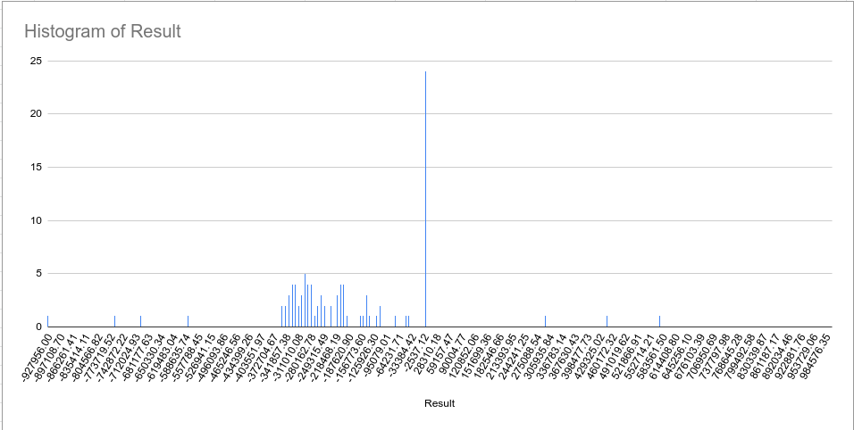

# TW Lab 1

## Zad. 1

Stworzono program [`UnsafeRace`](src/main/java/UnsafeRace.java) według specyfikacji. Program zazwyczaj zwraca wartość
licznika różną od zera, przy czym zwracane wartości znacząco różnią się między uruchomieniami — mamy do czynienia z
wyścigiem.

## Zad. 2

Stworzono program [`RaceHistogram`](src/main/java/RaceHistogram.java) wywołujący 100 razy program z zad. 1. Program
zapisuje wyniki poszczególnych uruchomień do pliku CSV. Na podstawie pliku stworzono poniższy histogram:

Jak widać, rozrzut wyników jest dosyć spory, z tendencją ku wartościom ujemnym (prawdopodobnie powodowane kolejnością
wywołań metod `start()` na obu wątkach, po zmianie kolejności trend się odwraca w kierunku wartości dodatnich). Spora
część prób skutkowała też wynikiem równym lub bliskim zera. Średnia wynosi -174937.6869.

## Zad. 3

W celu zabezpieczenia przed wyścigiem stworzono prostą klasę [`Lock`](src/main/java/util/Lock.java) opartą
na `AtomicBoolean`. Klasa udostępnia metody `acquire()` i `release()` pozwalające go odpowiednio zająć (i, jeśli jest
zajęty, poczekać aż inny wątek go zwolni) i zwolnić.  
Stworzono program [`SafeRace`](src/main/java/SafeRace.java) który rozszerza program z zad. 1 o użycie klasy `Lock`.
Przetestowano go kilkukrotnie przy użyciu programu `RaceHistogram`. W żadnym wypadku nie udało się uzyskać wyniku
różnego od zera.
